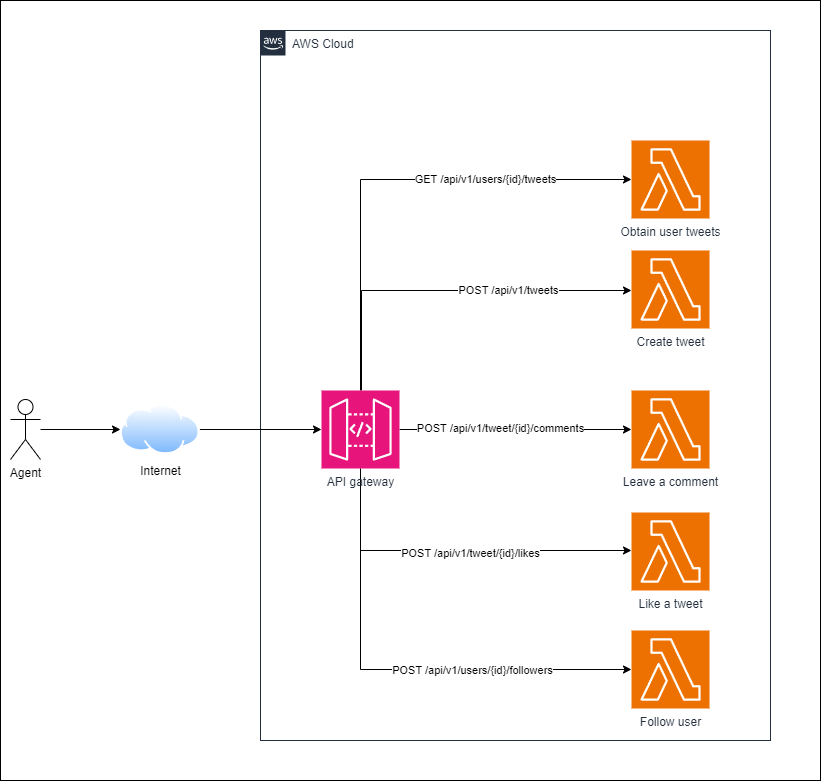
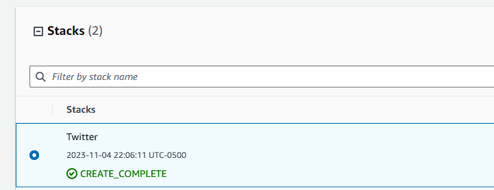
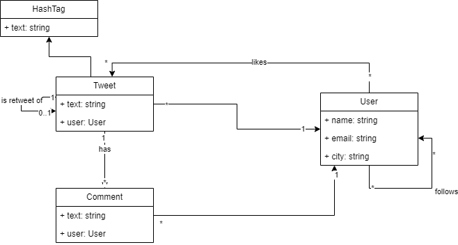
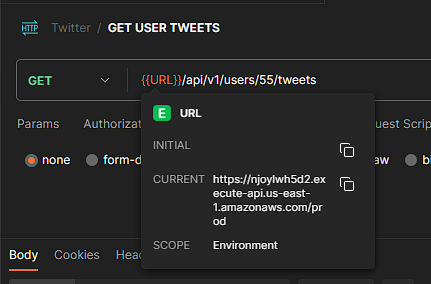
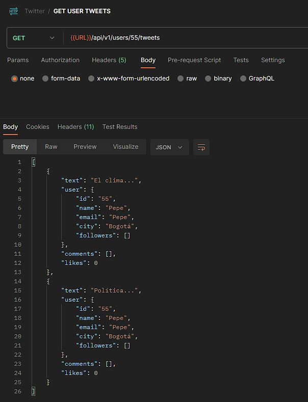
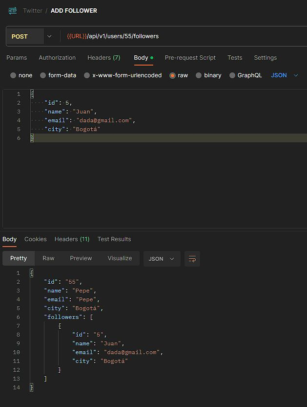
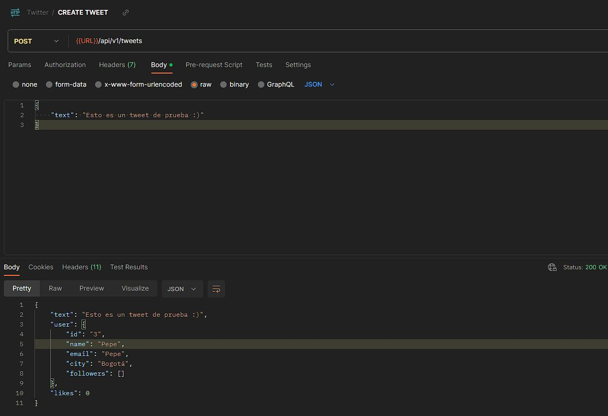
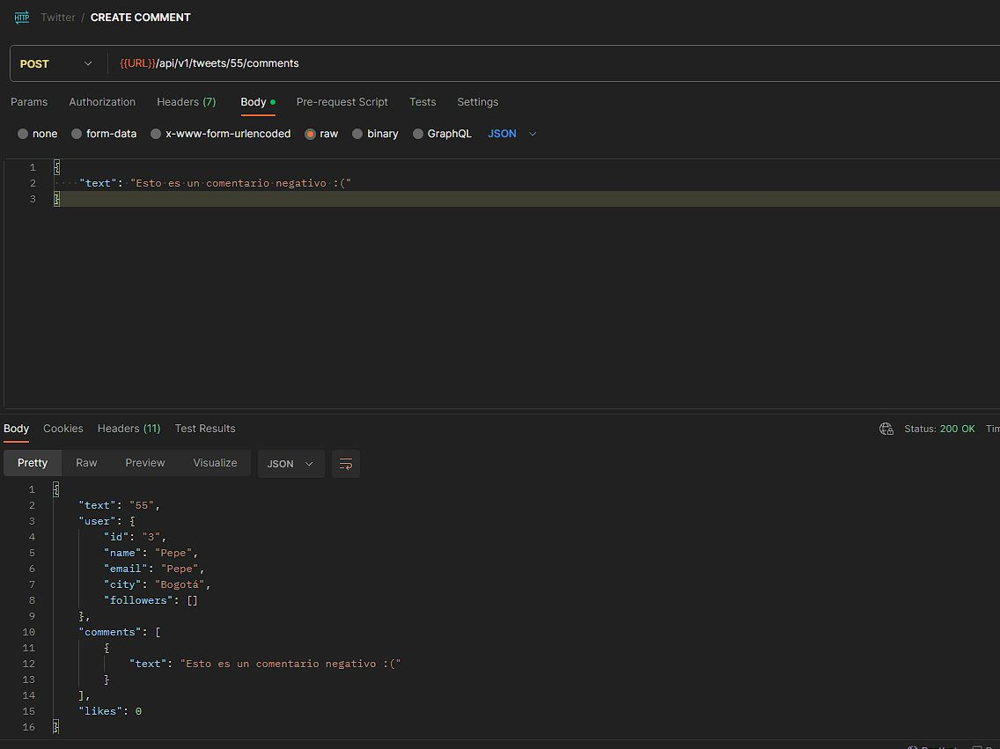
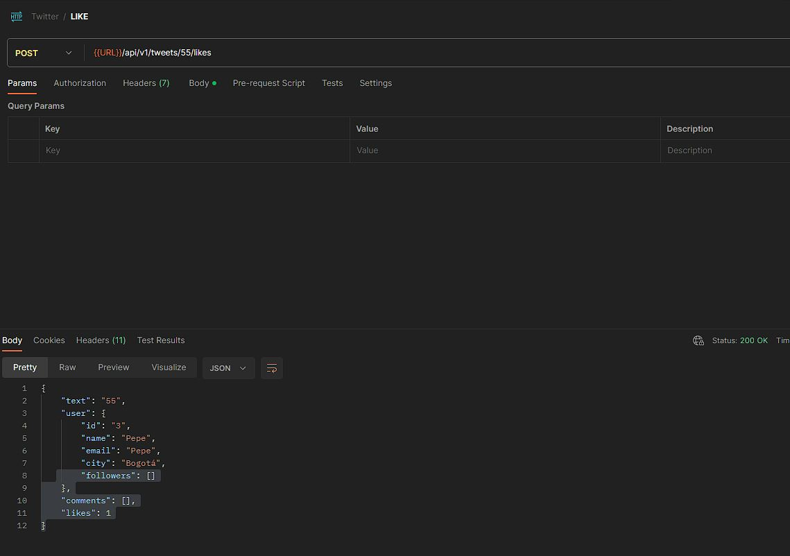

# Spark Web App

A simple twitter architecture using AWS lambdas and API Gateway.

# Architecture

The architecture of this project is as follows.



- A API gateway receiving requests from internet
- 5 lambdas that receive the requests from every endpoint and processes

# Prerequisites

- Docker
- AWS
- Visual studio dev containers plugin


## How to build the architecture

Open the folder with dev containers and wait the container to start. The container has the following libraries:
- Java 17
- Maven
- AWS CDK
- AWS CLI


Create a s3 bucket to upload the jar file. The container 

```bash
aws s3api create-bucket --bucket codebuckettwitter --region us-east-1
```


Build the lambdas JAR.

```bash
mvn clean package
```
Upload the JAR to s3.

```bash
aws s3 cp target/twitter-architecture.jar s3://codebuckettwitter
```

Build cloud formation templates.

```bash
cdk synth TwitterArchitectureAPIStack > template.yaml
```

Upload the template to cloud formation

```bash
aws cloudformation create-stack --stack-name Twitter --template-body file://template.yaml
```

Validate that the stack creation is completed.



Once you are done, delete the resources

```bash
aws cloudformation delete-stack --stack-name Twitter
```

Delete the bucket

```bash
aws s3 rm s3://codebuckettwitter/ --recursive && aws s3api delete-bucket --bucket codebuckettwitter
```

## Twitter entity

This is a general data architecture of the solution.




Use cases identified.


## Testing the app

First lets get the API gateway identifier.

```bash
aws apigateway get-rest-apis --query 'items[].{API_ID:id, API_URL: @.id}[0].API_ID'
```

The final URL has the following structure.

https://{id}.execute-api.{region}.amazonaws.com/{stage}

My URL is the next



## Get user tweets




## Add follower



## Create tweet



## Create comment



## Like tweet

